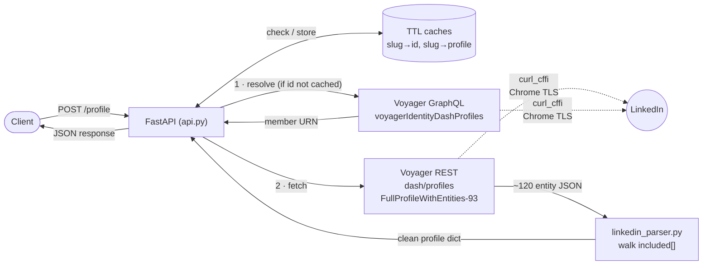
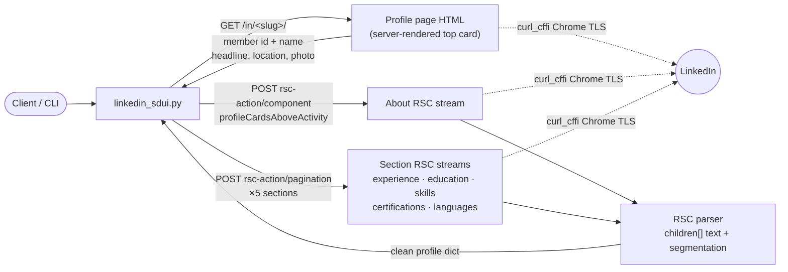
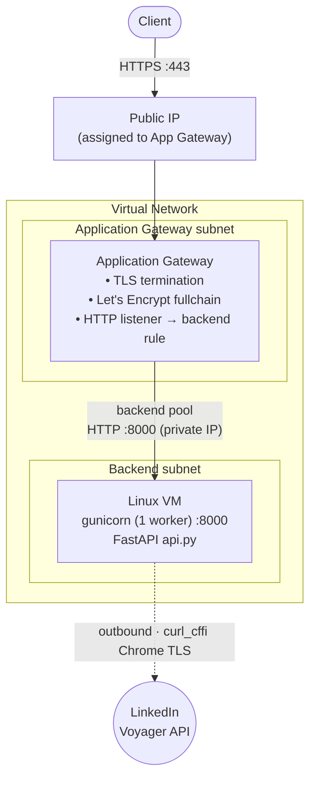

# LinkedIn Profile API

A hosted HTTP API that accepts a LinkedIn profile URL and returns the profile's
public details — name, headline, location, about, experience, education, skills,
certifications, languages, and profile photo — as structured JSON.

Two independent implementations are included:

| Approach | Role | Data source | Output |
|----------|------|-------------|--------|
| **Voyager** | **Primary** | LinkedIn's Rest.li `identity/dash` endpoints | clean normalized JSON, ~2 calls/profile |
| **SDUI / RSC-worker** | Secondary | LinkedIn's current Server-Driven-UI `rsc-action` endpoints | parsed from the RSC stream, ~7 calls/profile |

Both authenticate with a logged-in member session (`li_at` + `JSESSIONID`) and
use `curl_cffi` Chrome TLS impersonation. There is **no official LinkedIn API**
that returns arbitrary third-party profile data; both approaches consume
LinkedIn's private, undocumented internal APIs.

**The hosted `POST /profile` endpoint runs the Voyager technique.** It is the
only approach wired into `api.py`; SDUI/RSC-worker exists as a standalone
CLI module and is not exposed over HTTP (see the note at the end of the
[SDUI / RSC-worker](#secondary--sdui--rsc-worker) section).

---

## Table of contents

- [How it works](#how-it-works)
  - [Primary — Voyager](#primary--voyager)
  - [Secondary — SDUI / RSC-worker](#secondary--sdui--rsc-worker)
- [Project structure](#project-structure)
- [Setup](#setup)
- [Configuration](#configuration)
- [Running the API](#running-the-api)
- [Deployment (Azure Linux + HTTPS)](#deployment-azure-linux--https)
- [API documentation](#api-documentation)
- [Known limitations](#known-limitations)
- [Legal & ToS](#legal--tos)

---

## How it works

Both approaches share the same shape:

```
profile URL  ->  vanity slug  ->  member id  ->  profile data  ->  clean JSON
```

The only differences are which endpoints supply the member id and the data, and
how that data is parsed.

### Primary — Voyager

The Voyager path is the default because it returns **clean, normalized JSON in a
single data call**.

```
1. vanity slug -> member id
   GET /voyager/api/graphql
       ?variables=(vanityName:<slug>)
       &queryId=voyagerIdentityDashProfiles.<hash>
   -> returns the member URN (urn:li:fsd_profile:ACoAA...)

2. member id -> full profile
   GET /voyager/api/identity/dash/profiles
       ?q=memberIdentity&memberIdentity=<id>
       &decorationId=...FullProfileWithEntities-93
   -> one response with ~120 "included" entities:
      Profile, Position, Education, Skill, Certification, Language,
      Company, School, Geo, ...
```

The `included` array is a flat, URN-keyed entity graph. `linkedin_parser.py`
walks it and emits the clean profile dict — no per-section requests, no stream
parsing.



- **`queryId`** is a *persisted-query* identifier: instead of a GraphQL query
  string, LinkedIn's client sends a registered id. `voyagerIdentityDashProfiles`
  resolves an identity to a member URN.
- **`decorationId`** is a Rest.li *projection*: `FullProfileWithEntities` tells
  the server to expand the entire profile plus all nested entities in one shot.
  It is **versioned** (`-93`, `-91`, `-35`); the client tries them in order and
  falls back on failure.

**Provenance note.** The Voyager `queryId` and `decorationId` values originate
from community reverse-engineering (the `linkedin-api` lineage), captured from
LinkedIn's web app **before its SDUI migration**. These Rest.li endpoints are no
longer exercised by the current desktop web client but remain **live server-side
for backward compatibility**, and are independently verified in this
implementation. The underlying protocols (Rest.li projections, GraphQL persisted
queries) are documented; the specific identifiers are not.

**How this was discovered.** The Voyager approach was found **partially** by
inspecting live network requests and **partially** by researching how LinkedIn's
Voyager API works in general (its Rest.li conventions, persisted-query and
decoration mechanics) — since the endpoints themselves predate the current web
client and are no longer emitted in normal browser traffic.

### Secondary — SDUI / RSC-worker

LinkedIn migrated the profile page to **Server-Driven UI (SDUI)** built on React
Server Components (RSC / "Flight"). This path uses **only endpoints the current
web client actually fires** — everything here is observable in live browser
traffic — at the cost of more requests and RSC-stream parsing.

```
1. vanity slug -> member id + top card
   GET /in/<slug>/                     (profile page HTML)
   -> member id (ACoAA... embedded next to the slug)
   -> name, headline, location, photo  (server-rendered top card)

2. about
   POST /flagship-web/rsc-action/actions/component
        componentId = ...profileCardsAboveActivity
   -> about summary (reference-resolved from the RSC stream)

3. each section
   POST /flagship-web/rsc-action/actions/pagination
        pagerId = com.linkedin.sdui.pagers.profile.details.<section>
        payload = { vanityName, profileId, start, count,
                    detailSectionReplaceableComponentRef }
   -> experience, education, skills, certifications, languages
```

`sdui_parser.py` (bundled in `linkedin_sdui.py`) extracts visible text from the
RSC stream — the `"children":["..."]` nodes in document order — and segments it
into structured records (dates anchor experience/education; the About card is
resolved via its `$L` component reference to avoid grabbing Services/Featured
text).



The SDUI `pagerId`s are **hash-free dotted names** (`...details.experience`,
`...details.education`, …), so they do not rotate between builds the way a
GraphQL `queryId` does.

**How this was discovered.** The SDUI / RSC-worker approach was found entirely
by analysing live network requests fired by the current LinkedIn web client —
every endpoint and payload shape here is observable directly in browser
traffic, with no external research needed.

> The SDUI implementation ships as a **standalone module / CLI**
> (`linkedin_sdui.py`), not wired into the HTTP API. The `POST /profile`
> endpoint serves the **Voyager** approach only; run SDUI directly from the
> command line (see [Running the API](#running-the-api)).

**Why Voyager is primary and SDUI secondary.** Voyager returns clean JSON in one
call and needs no HTML parsing; SDUI requires ~7 calls and heuristic parsing of a
rendered stream. SDUI's advantage is provenance (100% current-traffic) and
resilience to Voyager rate-limits. Use Voyager by default; fall to SDUI when you
need current-traffic endpoints or when Voyager is throttled.

---

## Project structure

```
.
├── linkedin_profile.py     # Voyager client  (primary)
├── linkedin_parser.py      # Voyager normalized-JSON parser (pure functions)
├── linkedin_sdui.py        # SDUI client + RSC parser  (secondary, self-contained, CLI-only)
├── api.py                  # FastAPI app: POST /profile, GET /, caching (Voyager)
├── requirements.txt
├── .env                    # secrets — NOT committed
├── .env.example
└── README.md
```

---

## Setup

Requires Python 3.10+.

```bash
git clone <your-repo-url>
cd <repo>

python3 -m venv .venv
source .venv/bin/activate        # Windows: .venv\Scripts\activate

pip install -r requirements.txt
```

`requirements.txt`:

```
fastapi
uvicorn
gunicorn
curl_cffi
python-dotenv
```

`curl_cffi` is **required** for both approaches — it impersonates Chrome's TLS
fingerprint (JA3/JA4). Plain `requests`/`curl` is detected by LinkedIn at the TLS
layer and triggers session invalidation. See
[Known limitations](#known-limitations).

---

## Configuration

Credentials are read from environment variables (via a `.env` file, loaded with
`python-dotenv`). **Never commit real values.**

Create `.env`:

```
LI_AT=AQEDAT...your_li_at_cookie...
JSESSIONID=ajax:1234567890123456789
API_KEY=change-me-optional
CACHE_TTL=3600
ID_TTL=86400
```

- **`LI_AT`** — the `li_at` cookie from a logged-in linkedin.com session.
- **`JSESSIONID`** — the `JSESSIONID` cookie value, including the `ajax:` prefix,
  **without** surrounding quotes. `csrf-token` is derived from it. It must come
  from the **same session** as `LI_AT`.
- **`API_KEY`** — optional; if set, callers must send `X-API-Key`.
- **`CACHE_TTL`** — seconds to cache a full profile (default 3600).
- **`ID_TTL`** — seconds to cache a vanity→member-id mapping (default 86400).

### Getting the cookies

1. Log into linkedin.com in Chrome.
2. DevTools → Application → Cookies → `https://www.linkedin.com`.
3. Copy `li_at` → `LI_AT`, and `JSESSIONID` (value like `ajax:...`) → `JSESSIONID`.

`.gitignore` must include:

```
.env
li_state.json
li_profile/
__pycache__/
.venv/
```

---

## Running the API

### Development

```bash
uvicorn api:app --host 127.0.0.1 --port 8000 --reload
```

### Production (single worker — required)

```bash
gunicorn api:app -k uvicorn.workers.UvicornWorker -w 1 --timeout 60 -b 0.0.0.0:8000
```

> **Run exactly one worker.** Each worker is a separate process with its own
> cookie jar. Multiple workers become multiple consumers of the same `li_at`;
> when LinkedIn rotates the token they conflict and log the session out. One
> worker = one session owner. Concurrency is still handled by the ASGI
> threadpool. To scale beyond one process you must externalize the session and
> caches (e.g. Redis) with a single rotation owner.

### CLI (either client, no server)

```bash
python linkedin_profile.py https://www.linkedin.com/in/<slug>/   # Voyager
python linkedin_sdui.py    https://www.linkedin.com/in/<slug>/   # SDUI
```

---

## Deployment (Azure Linux + HTTPS)

1. Provision a Linux VM; open 8080 via the NSG.
2. Deploy the app; run gunicorn bound to `0.0.0.0:8000` under `systemd`.
3. Terminate TLS at  the Application Gateway and proxy to the app via backend rules and backed settings in azure application gateway.
4. **Serve the full certificate chain** — use Let's Encrypt `fullchain.pem`
   (leaf + intermediate), not `cert.pem`. A leaf-only chain causes
   `Verify return code: 21` and forces clients to use `curl -k`.
5. **Session hygiene** (see limitations): use a **dedicated** LinkedIn account
   for the server, never logged into a browser elsewhere; ideally create the
   session **on the server** so its origin IP matches where it's used.

### Deployment architecture

The public entry point is an **Azure Application Gateway** that lives in its
**own subnet** inside a Virtual Network. It terminates TLS and forwards traffic
over the VNet to a **backend pool** containing the Linux VM, which runs gunicorn.
The VM makes outbound calls to LinkedIn using `curl_cffi` TLS impersonation.



- **App Gateway subnet** is dedicated to the gateway (Azure requires the gateway
  to have its own subnet).
- **Backend subnet** holds the VM; the gateway reaches it by its private IP via a
  backend pool + HTTP backend settings on port 8000.
- Only the gateway is internet-facing; the VM has no public ingress (NSG allows
  8000 only from the gateway subnet).

### TLS certificate (free, via Certbot)

The certificate was issued **free with [Certbot](https://certbot.eff.org/)** using
the **HTTP-01 challenge**, then moved to the gateway:

1. **Point the public IP at the VM temporarily.** The domain
   (`<host>.cloudapp.azure.com`) resolved to the VM's public IP.
2. **Run Certbot on the VM.** Certbot answered the HTTP-01 challenge on port 80
   directly from the server (Let's Encrypt fetched a token file over HTTP to
   prove domain control), and issued the cert into
   `/etc/letsencrypt/live/<host>/` (`fullchain.pem` + `privkey.pem`).
3. **Move the public IP to the Application Gateway.** The public IP was then
   **dissociated from the VM and associated with the Application Gateway**, so the
   gateway became the internet-facing endpoint.
4. **Upload the cert to the gateway listener.** `fullchain.pem` + `privkey.pem`
   were packaged as a PFX and uploaded to the HTTPS listener, so the gateway
   serves the **full chain** (avoiding the `Verify return code: 21` / `curl -k`
   problem).

> Because HTTP-01 validates by serving a file over port 80, the challenge had to
> run while the public IP was on the VM. After issuance the IP was reassigned to
> the gateway; renewals can be handled via a DNS-01 challenge, or by temporarily
> routing `/.well-known/acme-challenge/` through the gateway to the VM.

## API documentation

### `POST /profile`

Fetch a profile's details.

**Request**

```
POST /profile
Content-Type: application/json
X-API-Key: <key>            # only if API_KEY is set
```

```json
{
  "url": "https://www.linkedin.com/in/ankur-dhawan01/"
}
```

| Field | Type | Required | Description |
|-------|------|----------|-------------|
| `url` | string | yes | A LinkedIn profile URL or bare vanity slug |

**Response `200`**

```json
{
  "cached": false,
  "name": "Ankur Dhawan",
  "first_name": "Ankur",
  "last_name": "Dhawan",
  "headline": "MTS-2 @Adobe | Top 0.1% Club @topmate | Ex @MakeMyTrip",
  "location": "Gurugram, Haryana, India",
  "about": "…",
  "profile_photo": "https://media.licdn.com/dms/image/…",
  "experience": [
    {
      "title": "Member of Technical Staff 2",
      "company": "Adobe",
      "employment_type": "Full-time",
      "location": "Noida, Uttar Pradesh, India",
      "date_range": "2025-05 – Present",
      "description": null
    }
  ],
  "education": [
    { "school": "Chandigarh University", "degree": "BTech", "field_of_study": "Computer Science", "date_range": "2018-2022", "grade": null }
  ],
  "skills": ["Java", "Distributed Systems", "…"],
  "certifications": [
    { "name": "…", "authority": "…", "license_number": "…", "url": "…" }
  ],
  "languages": [
    { "name": "English", "proficiency": "Professional working proficiency" }
  ],
  "public_identifier": "ankur-dhawan01",
  "profile_url": "https://www.linkedin.com/in/ankur-dhawan01/"
}
```

> This endpoint returns the **Voyager** schema (shown above). The SDUI CLI
> produces a slightly different shape (e.g. a `"source": "sdui"` field and
> `degree_field` instead of `degree`). The response schema is intentionally
> implementation-owned per the challenge.

**Error responses**

| Status | Meaning |
|--------|---------|
| `400` | Missing/invalid `url` |
| `401` | Missing or wrong `X-API-Key` |
| `404` | Profile not found / could not resolve member id |
| `429` | Rate-limited by LinkedIn |
| `502` | Upstream session invalid/expired — refresh `LI_AT` + `JSESSIONID` |

**Examples**

```bash
# Primary (Voyager)
curl -X POST https://<host>/profile \
  -H 'content-type: application/json' \
  -d '{"url":"https://www.linkedin.com/in/ankur-dhawan01/"}' | jq
```

### `GET /`

Liveness check.

```json
{ "status": "ok" }
```

---

## Caching

To minimise calls to LinkedIn (and stay well under the rate limit), the API uses
two thread-safe, in-memory TTL caches keyed by the vanity slug:

| Cache | Key → Value | Default TTL | Purpose |
|-------|-------------|-------------|---------|
| `_profile_cache` | slug → full profile JSON | `CACHE_TTL` (1h) | serve repeat lookups with **zero** LinkedIn calls |
| `_id_cache` | slug → member id | `ID_TTL` (24h) | skip the resolver call on later fetches |

The member id is stable for a slug, so it is cached far longer than the profile
data itself. This produces a tiered call count:

| Request state | LinkedIn calls made |
|---------------|---------------------|
| Profile cached (within `CACHE_TTL`) | **0** — served from `_profile_cache` |
| Profile expired, id cached (within `ID_TTL`) | **1** — resolver skipped, only the profile is re-fetched |
| Fully cold (both caches miss) | **2** — resolve member id **+** fetch profile |

Cold data requires two calls because resolution and data come from **different
endpoints**: the resolver returns only the member URN, and the profile-data
endpoint requires that member id as input — no single call maps a slug directly
to a full profile. Caching the slug→id mapping removes the resolver call on
subsequent requests (2 → 1), and caching the full profile removes both (→ 0).

If a cached member id has gone stale (a slug reassigned or changed), the failed
fetch invalidates it and re-resolves once. TTLs are configurable via the
`CACHE_TTL` and `ID_TTL` environment variables. The caches are per-process and
in-memory; scaling beyond a single worker requires an external store (e.g. Redis)
— see [Running the API](#running-the-api).

---

## Known limitations

### Shared (both approaches)

- **Undocumented private API.** These are LinkedIn's internal endpoints, not an
  official/supported API. Structure, identifiers, and behavior can change without
  notice.
- **Session-based auth, not tokens.** Requires a live member session
  (`li_at` + `JSESSIONID`); there is no OAuth path to this data. `li_at`'s
  expiry is long (typically months) but its **value rotates frequently** and can
  be revoked early (logout, password change, security events).
- **TLS fingerprinting / logouts.** LinkedIn fingerprints the TLS handshake
  (JA3/JA4). Requests from a non-browser client are flagged and can trigger
  session rotation → the browser/other consumer gets logged out. `curl_cffi`
  Chrome impersonation is **required** to avoid this. Additionally, a single
  account used in two places (server + browser, or two workers) triggers
  account-level security that logs out all sessions — use a dedicated,
  server-exclusive account.
- **Datacenter IPs.** Sessions created at one location and used from a datacenter
  IP (e.g. Azure) can be revoked as "impossible travel." Create the session on
  the server, and/or route egress through a consistent residential proxy.
- **Rate limits.** Rapid sequential calls are throttled (observed ≈25 requests
  before a soft-block that manifests as a 302 redirect loop). Mitigated by
  caching and pacing; not eliminated.
- **Session "warm-up".** Observed in testing: a *freshly minted* session token
  used immediately for an automated call was frequently invalidated after a
  **single request**, logging the account out. The token appears to need a period
  of normal browser activity before it is stable for programmatic use — i.e. a
  session must accumulate a certain amount of ordinary traffic before it can be
  relied on for API calls. Practically: log in, browse normally for a bit, *then*
  put that session to work; don't drive a brand-new token straight into automation.
- **Access scope.** Only data visible to the authenticated session is returned.
  Private profiles, or fields hidden from the viewer, are unavailable.
- **Terms of Service.** Automated access to LinkedIn's internal API is contrary
  to LinkedIn's User Agreement. This is a reverse-engineering exercise, not a
  licensed data source.

### Voyager (primary)

- **Legacy endpoints.** The `dash/profiles` + `FullProfileWithEntities` decoration
  are not used by the current web client; they remain live for backward
  compatibility but could be retired at any time. The old aggregate `profileView`
  endpoint already returns `410 Gone`.
- **Versioned `decorationId`.** `FullProfileWithEntities-<N>` is version-pinned;
  when LinkedIn increments it, the current value may fail. The client keeps a
  fallback list (`-93`, `-91`, `-35`) but may eventually need a fresh value.
- **`queryId` drift.** The resolver's persisted-query hash can be re-registered
  under a new hash on a new build, requiring re-capture.
- **`location` on the Profile entity** may be `null`; it is resolved from a
  linked `Geo` entity when present.
- **Self-view vs third-party.** Some `dash` variants behave differently for the
  authenticated member vs others; verified working cross-profile with a fresh,
  matching cookie pair.
- **More aggressive rate-limiting / early session invalidation.** As a *legacy*
  endpoint family, Voyager was noticeably more prone than SDUI to throttling and
  to invalidating the session early during testing — it repeatedly logged the
  account out (especially on a not-yet-warmed-up token; see "Session warm-up"
  above). This is the main operational cost of the primary path, and the reason
  caching + a warmed, dedicated session matter most here.

### SDUI / RSC-worker (secondary)

- **More requests.** ~7 calls per profile (HTML + about + 5 sections) vs Voyager's
  2 — higher latency and more rate-limit exposure.
- **Stream parsing, not JSON.** Data is extracted from the RSC ("Flight") stream
  by text position and boundary heuristics; a layout change on LinkedIn's side
  can shift what the parser sees.
- **Heuristic top-card fields.** `headline`, `location`, and `profile_photo` are
  parsed from the rendered profile-page HTML (anchored on the Contact-info link).
  They are the most fragile fields; if a profile hides the Contact-info link,
  `headline`/`location` may be `null`.
- **`about` reference resolution.** About is resolved from the
  `profileCardsAboveActivity` component by following its `$L` reference; profiles
  with no written About correctly return `null`.
- **Build-pinned pieces.** While `pagerId`s are stable dotted names, other SDUI
  identifiers (`x-li-application-version`, component ids) are tied to LinkedIn
  frontend builds and may need updating.

**Upside (vs Voyager).** Despite the higher call count and heavier parsing, SDUI
was **more session-friendly** in testing: because these are the endpoints the
current web client actually uses, they rate-limited **less aggressively** and were
**less likely to expire the session early** than the legacy Voyager path. If the
primary path keeps logging the session out, SDUI is the more resilient fallback.
